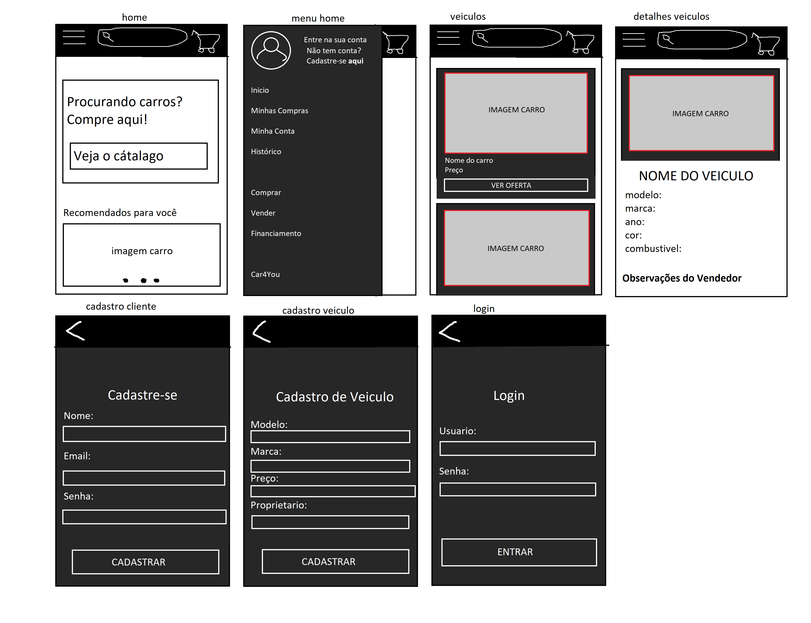

# App Loja de Veiculos
Projeto desenvolvido em Ionic para uma atividade. Com o intuito de simular uma loja fictícia de veículos integrado a uma API que realiza o cadastro destes veiculos e os clientes.

**Versão Web:** https://github.com/MariaFernandaSSO/Site_LojaVeiculos

Observações: Esta atividade pedia que tivesse o site e o aplicativo. Eu desenvolvi junto a um colega de classe. 

WireFrame Inicial:

</img>

### Resultado final:
## Home 

## Minhas compras e  Minha conta

## Histórico e Cadastro

## Login e "Vender"/Cadastro do Veiculo

## Comprar / Botão "Veja o catálogo"

### Botão "Ver Oferta"

